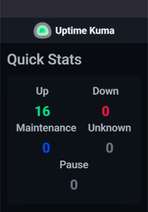

# UKW


A containerized *U*ptime *K*uma *W*rapper for [uptime-kuma-api](https://github.com/lucasheld/uptime-kuma-api).

It has one single endpoint and purpose: UKW looks through all monitors set up in an Uptime Kuma installation and returns "200, all up" if *all* are returning "UP" status. 

In other words, it turns



into

```bash
$ curl localhost:5000/status/all
{"message":"all up"}
```

One non-Up monitor entry will result in an overall "503, not all up" regardless of the results from any other monitor.

That's all folks.

Notes:
- For UKW to work, Uptime Kuma needs to be set up with authentication disabled! (I'm runnning my Uptime Kuma in a private [tailscale](https://tailscale.com/) net.)
- Depending on the amount of monitors set up, the underlying call may take a bit to return, i.e., it's a blocking, synchronous call.
- In German, "UKW" stands for Very High Frequency. Hence, the logo.

Disclaimer: I used ChatGPT to create logo and code.

## Usage

Hint: You can customize your Uptime Kuma URL by running `echo "UPTIME_KUMA_URL=https://status.example.com" > .env`

Build image & run as a container:

```bash
make build
make run
```

Browse to http://localhost:5000/status/all (default).

In my case, I use an ESP32-S3 to check this endpoint response and turn its LED green or red as a simple up/down indicator.

Use `make stop` to stop and force-remove the container again.

## Other References

- [Run Python Applications as non-root user in Docker Containers — by example](https://medium.com/@DahlitzF/run-python-applications-as-non-root-user-in-docker-containers-by-example-cba46a0ff384)