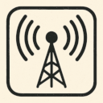

# UKW



*U*ptime *K*uma *W*rapper — a lightweight server + hardware client that turns your [Uptime Kuma](https://github.com/louislam/uptime-kuma) monitor statuses into a simple physical indicator.

In German, "UKW" stands for *Ultrakurzwelle* (Very High Frequency). Hence, the name.

## Architecture

```
┌──────────────┐        ┌─────────────┐        ┌─────────────────────────┐
│  Uptime Kuma │◄───────│  UKW Server │◄───────│  UKW Client             │
│  (monitors)  │  API   │  (Flask)    │  HTTP  │  (ESP32-S3 + LCD & LED) │
└──────────────┘        └─────────────┘        └─────────────────────────┘
```

**Server** — A containerized Flask app that wraps the Uptime Kuma API and exposes simplified REST endpoints (`/status/all`, `/status/monitors`, `/version`).

**Client** — A MicroPython program running on a Waveshare ESP32-S3 board that polls `/status/monitors` and displays each monitor's up/down status on the 1.47" LCD screen (with an RGB LED for aggregate status).

## Quick Start

### Server

```bash
cd server
make build
make run
# http://localhost:5000/status/monitors
```

See [server/README.md](server/README.md) for full details.

### Client

1. Flash MicroPython onto the Waveshare ESP32-S3.
2. Create `client/.env` with your WiFi and server settings.
3. Copy `client/*.py` to the board.
4. Reset — the LED will start reflecting monitor status.

See [client/README.md](client/README.md) for full details.

## Prerequisites

- An [Uptime Kuma](https://github.com/louislam/uptime-kuma) instance with authentication disabled (or behind a private network such as [Tailscale](https://tailscale.com/)).
- Docker (for the server).
- A Waveshare ESP32-S3 1.47" LCD board with MicroPython (for the client).

## Disclaimer

Use at your own risk. I'm not responsible for anything here.

I used ChatGPT to create the logo and Copilot to (vibe-)code (Claude Opus 4.6 for the Client code to be precise).
